# 雷铭b2b2c多用户商城系统

## 项目介绍

雷铭电商7.0系统，是基于SpringBoot开发，运营端和商户端采用Element+Vue，买家使用采用Vue+Iview+nuxt服务端渲染。使用到的中间件有Redis、RabbitMQ、ElasticSearch、FastDFS、Mongodb等。主要功能包括有运营管理、商品管理、订单管理、售后管理、会员管理、财务管理、商户入驻、优惠券、满减活动、拼团活动、秒杀、限时抢购、虚拟商品、余额支付等。

QQ群：754193730 <a target="_blank" href="https://qm.qq.com/cgi-bin/qm/qr?k=18mv-PYr6VIoxvwz8KkC9JoM8OUIoGb2&jump_from=webapi"></a>

## 公司官网
http://www.leimingtech.com/

## 演示地址
* 平台运营端 [http://b2b2c.leimingtech.com/admin](http://b2b2c.leimingtech.com/admin) 用户名/密码 admin/123456
* 商户端 [http://b2b2c.leimingtech.com/seller](http://b2b2c.leimingtech.com/seller) 用户名/密码 leiming/123456
* 用户端（H5使用手机浏览器）[http://b2b2c.leimingtech.com](http://b2b2c.leimingtech.com)
* 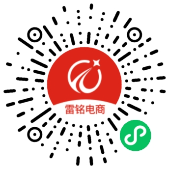
## 技术体系
### 基础框架
* Maven
* Spring
* Mybatis-Plus
* Spring Security
### 前端框架
* VUE
* Element
* iview
* nuxt
* uniapp
### 技术栈
* mysql
* fastdfs
* redis
* mongodb
* elasticsearch
* rabbitmq
* nginx
* docker
### 一键安装
* 1.安装docker环境(centos)
```shell script
 # step 1: 安装必要的一些系统工具
 sudo yum install -y yum-utils device-mapper-persistent-data lvm2
 # Step 2: 添加软件源信息
 sudo yum-config-manager --add-repo http://mirrors.aliyun.com/docker-ce/linux/centos/docker-ce.repo
 # Step 3: 更新并安装 Docker-CE
 sudo yum makecache fast
 sudo yum -y install docker-ce
 # Step 4: 开启Docker服务
 sudo service docker start
```
* 2.安装docker-compose
```shell script
#下载docker-comose
curl -L https://get.daocloud.io/docker/compose/releases/download/1.12.0/docker-compose-`uname -s`-`uname -m` > /usr/local/bin/docker-compose
#授权
chmod +x /usr/local/bin/docker-compose
#查看版本号，测试是否安装成功
docker-compose version    
```
* 3.上传docker-compose.yml到服务器,在docker-compose.yml 文件目录下启动docker-compose
```shell script
docker-compose up -d 
```
* 4.服务启动成功后，配置hosts
```
  将部署服务器的ip地址指向：leimingshop
  例如：192.168.1.108   leimingshop
```
* 5.访问服务
 ```
  平台运营端： http://leimingshop/admin 用户名密码：admin/123456
  商户端      http://leimingshop/seller 用户名密码： leiming/123456
  用户端：    http://leimingshop
  平台运营端接口地址： http://leimingshop/admin/doc.html
  商户端接口地址：    http://leimingshop/seller/doc.html
  用户端：          http://leimingshop/web/api/doc.html
```

### docker项目构建
* 1.首先需要先安装leimingshop-parent模块
```shell script
mvn clean install -f leimingshop-parent/pom.xml
```
* 2.构建全部工程
```shell script
mvn clean install -P test  -DskipTests=true 
```

* 3.配置docker仓库地址
```xml
<plugin>
        <groupId>com.spotify</groupId>
        <artifactId>docker-maven-plugin</artifactId>
        <configuration>
            <!-- 镜像名称-->
            <imageName>harbor.shop7.leimingtech.com/leimingshop/${project.artifactId}:${Tag}</imageName>
            <dockerDirectory>${project.basedir}/src/main/docker</dockerDirectory>
            <!--<dockerHost>http://harbor.shop7.leimingtech.com:2375</dockerHost>-->
            <!--dockerHost-->
            <dockerHost>http://localhost:2375</dockerHost>
            <resources>
                <resource>
                    <targetPath>/</targetPath>
                    <directory>${project.build.directory}</directory>
                    <include>${project.build.finalName}-${project.version}.zip</include>
                </resource>
            </resources>
            <buildArgs>
                <VERSION>${project.version}</VERSION>
                <PROJECT_NAME>${project.artifactId}</PROJECT_NAME>
            </buildArgs>
        </configuration>
    </plugin>
```
* 3.构建docker镜像
```shell script
#登录docker远程仓库
docker login xxx.com
# Tag： docker镜像版本号  
mvn clean install -P test  -DskipTests=true  -Dtag=1.0 docker:build
```


### 项目结构
~~~
leimingshop
|--doc
    |--db -- 数据库相关sql
    |--docker -- docker打包文件
    |--lib -- 项目所需jar包
|--leimingshop-admin 
    |--leimingshop-admin-api
    |--leimingshop-seller-api
|-- leimingshop-base
    |--leimingshop-commons
        |--leimingshop-commons-core -- 常用工具类
        |--leimingshop-commons-dynamic-datasource -- 动态数据源配置
        |--leimingshop-commons-lock -- 分布式锁配置
        |--leimingshop-commons-mybatis -- mybatis配置
        |--leimingshop-commons-tools -- 常用工具类
        |--leimingshop-logs -- 日志配置
    |--leimingshop-elasticsearch  -- elasticsearch模块
    |--leimingshop-mongodb -- mongodb模块
    |--leimingshop-mq -- RabbitMQ模块
    |--leimingshop-nosql -- 非关系型数据库模块
|--leimingshop-execute -- 定时任务执行器
|--leimingshop-front PC端相关接口
    |--leimingshop-auth -- 登录认证模块
    |--leimingshop-web-api -- PC端接口模块
|--leimingshop-frontend 前端代码
    |--leimingshop-admin -- 平台运营端前端代码
    |--leimingshop-protal -- PC端前端代码
    |--leimingshop-seller -- 商户端前端代码
|--leimingshop-monitor -- monitor监控中心
|--leimingshop-mq-consumer -- MQ消费者模块
|--leimingshop-parent -- 父工程，依赖管理
|--leimingshop-service -- 业务逻辑代码
    |--leimingshop-activity -- 活动模块
    |--leimingshop-after-sale -- 售后模块
    |--leimingshop-cart -- 购物车模块
    |--leimingshop-cms -- 圈子模块
    |--leimingshop-goods -- 商品模块
    |--leimingshop-index-sync -- 索引管理模块
    |--leimingshop-logistics -- 日志模块
    |--leimingshop-member -- 用户模块
    |--leimingshop-message -- 短信和邮箱模块
    |--leimingshop-operation -- 运营模块
    |--leimingshop-order -- 订单模块
    |--leimingshop-payment -- 支付模块
    |--leimingshop-quartz -- 定时任务模块
    |--leimingshop-settle -- 结算模块
    |--leimingshop-static -- 统计模块
    |--leimingshop-store -- 店铺模块
    |--leimingshop-sys -- 系统设置模块
    |--leimingshop-third-party -- 第三方相关模块
    |--leimingshop-upload -- 文件上传模块
    |--leimingshop-wechat -- 对接微信相关模块
~~~
### 项目配置
#### 后台项目
* 确保电脑已经安装JDK1.8，Mysql 5.7， Redis，fastdfs， mongodb，elasticsearch，rabbitmq
* 创建数据库
* 运行sql文件 /db/sql/leimingshop.sql
* 仓库中如果没有微信SDK，把微信SDK的jar包放进仓库中 /doc/lib/com/github/wxpay
* 修改对应环境配置文件中的 Redis，fastdfs，mongodb，elasticsearch，rabbitmq，连接信息
```yaml
  #数据库
  datasource:
    druid:
      # 数据库连接地址
      url: jdbc:mysql://127.0.0.1:3306/leimingshop?allowMultiQueries=true&useUnicode=true&characterEncoding=UTF-8&useSSL=false
      # 用户名
      username: root
      # 密码
      password: 123456
  # RabbitMQ
  rabbitmq:
    # MQ连接地址
    addresses: 127.0.0.1:5672
    # MQ账号
    username: guest
    # MQ密码
    password: guest
  #redis 
  redis:
    # redis连接地址
    host: 127.0.0.1
    # 端口号
    port: 6379
    # 密码
    password: 123456
  #ES
  elasticsearch:
    # 节点名称
    cluster-name: leimingshop
    # 链接地址
    host: 127.0.0.1:9200
    # 账号
    username: elastic
    # 密码
    password: elastic
   # mongodb
   data:
    mongodb:
      # 连接地址
      uri: mongodb://127.0.0.1:27017/admin
```
* 修改微信公众号配置
```yaml
wechat:
  #微信公众号的app appid
  appid: @appid@ 
  secret: @secret@
wx:
  mp:
    configs:
        #微信公众号的app appid
      - appid: @appid@
        #微信公众号的app secret
        secret: @secret@
        #微信公众号的token
        token: @token@
        #微信公众号的EncodingAESKey
        aesKey: @aesKey@
```
* 修改支付宝相关证书文件
```properties
# 应用公钥证书路径
ALIPAY.APP.CERT_PATH=/APPCRT/appCertPublicKey_2021001151690379.crt
# 支付宝公钥证书路径
ALIPAY.APP.ALIPAY_PUBLIC_CERT_PATH=/APPCRT/alipayCertPublicKey_RSA2.crt
# 支付宝根证书路径
ALIPAY.APP.ROOT_CERT_PATH=/APPCRT/alipayRootCert.crt
```
* 启动项目
    * 平台端接口文档：http://localhost:28081/admin-api/doc.html
    * 商家端接口文档：http://localhost:28080/seller-api/doc.html
    * PC端接口文档：http://localhost:17070/web/api/doc.html

* [修改短信配置](doc/image/msg.png)
* [修改邮箱配置](doc/image/email.png)
* [同步ES索引信息](doc/image/es.png)
* [修改文件上传配置](doc/image/upload.png)
#### 前端vue项目
* 确保本地环境安装了node.js
* 分别进入前端目录执行打包命令:

  /leimingshop-frontend/leimingshop-admin

  /leimingshop-frontend/leimingshop-seller

  /leimingshop-frontend/leimingshop-protal

``` shell script
npm install 
```
* admin 和 seller 更改接口地址和图片地址
``` 
# 后台接口地址
window.SITE_CONFIG['apiURL'] = 'http://leimingshop';
# 图片地址
window.SITE_CONFIG['imgURL'] = 'http://leimingshop';
# PC端接口地址
window.SITE_CONFIG['pcURL'] = 'http://leimingshop';
```

* protal 更改接口地址和图片地址
``` javascript 1.8
dev: {
    MODE: 'develpment',
    # 接口地址
    ENV_API: 'http://leimingshop'   
},
```

* admin 和 seller 启动命令
``` shell script
npm run serve 
```
* protal 端启动命令
``` shell script
npm run dev 
```


## 演示数据以及图片下载
链接: [https://pan.baidu.com/s/1terAQHQO5geR_rtWiAOHCg](https://pan.baidu.com/s/1terAQHQO5geR_rtWiAOHCg) 提取码: q8cm 

## 功能介绍
* [平台端菜单](doc/md/adminMenu.md)
* [商户端菜单](doc/md/sellerMenu.md)
* [主体流程](doc/image/img_16.png)
* [丰富的营销玩法](doc/image/img_19.png)
* [丰富的商品模式](doc/image/img_20.png)
* [灵活的四个“中心”](doc/image/img_21.png)
* [多维度数据统计](doc/image/img_22.png)
## 页面展示
### App/H5/微信小程序展示
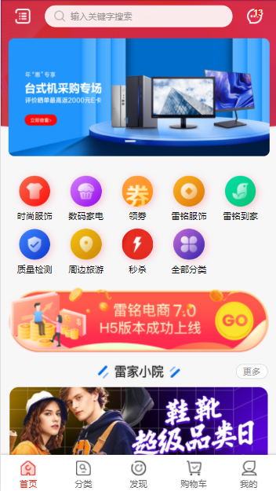


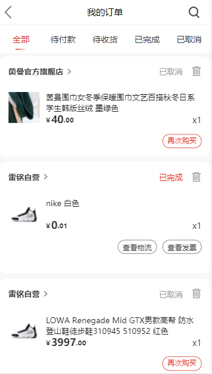
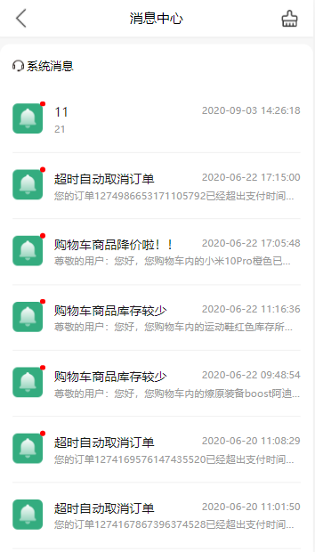

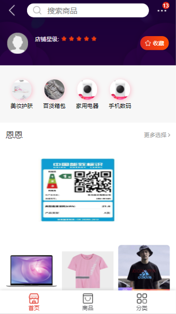
###  PC首页展示
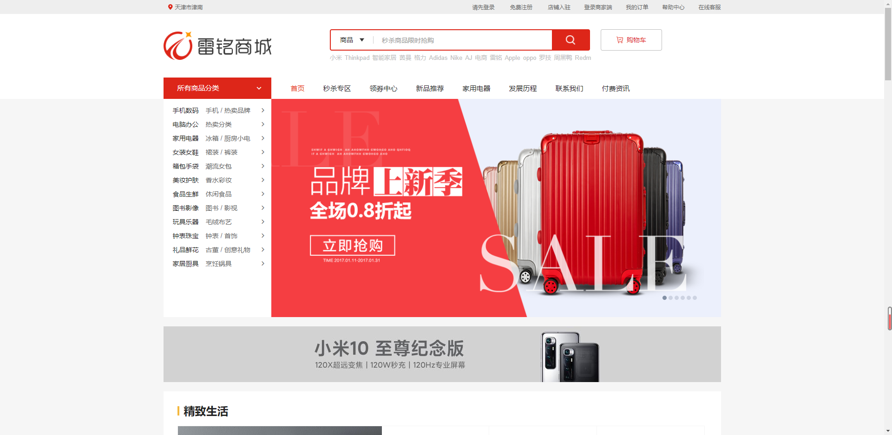
### 搜索页面
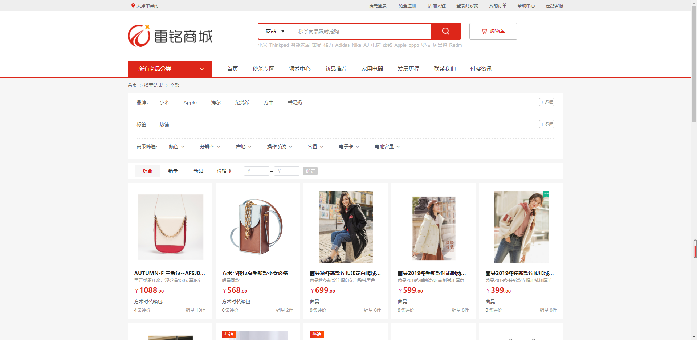
### 商品详情页
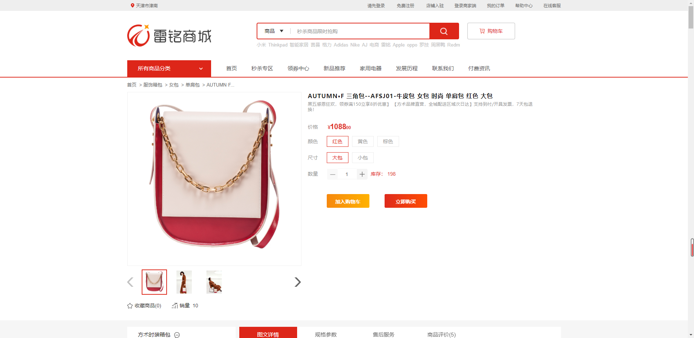
### 购物车结算页
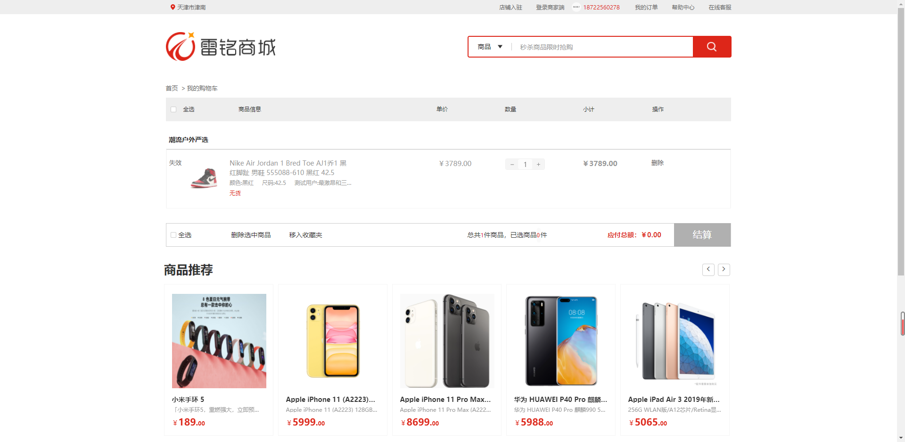
### 店铺搜索页
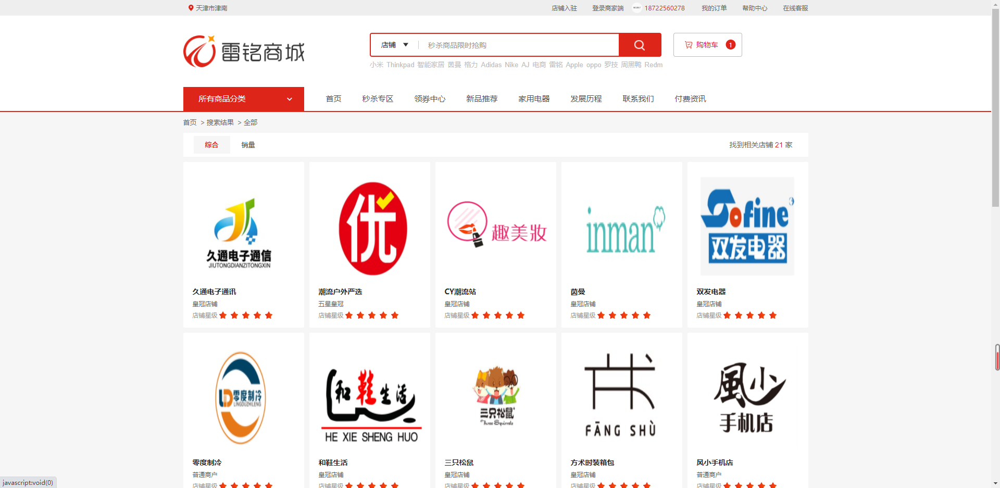
### 平台运营端首页
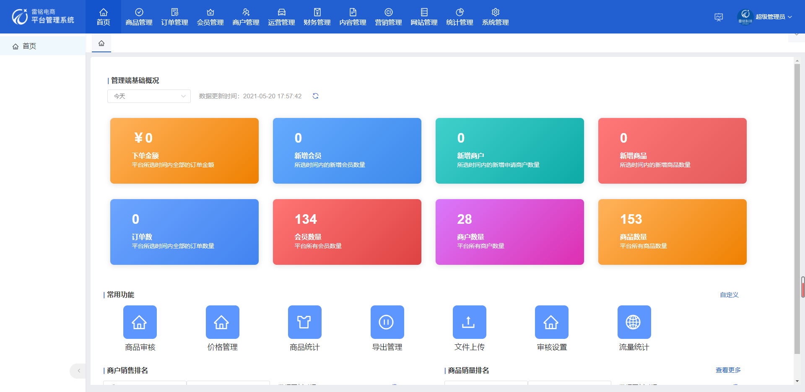
### 商品管理
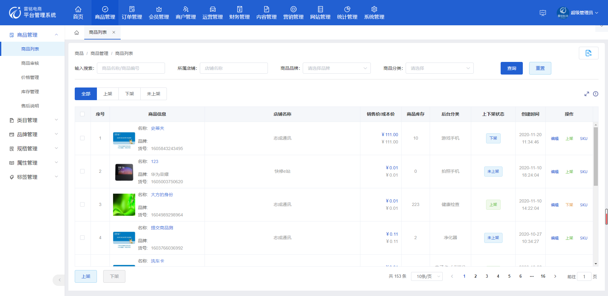
### 订单管理
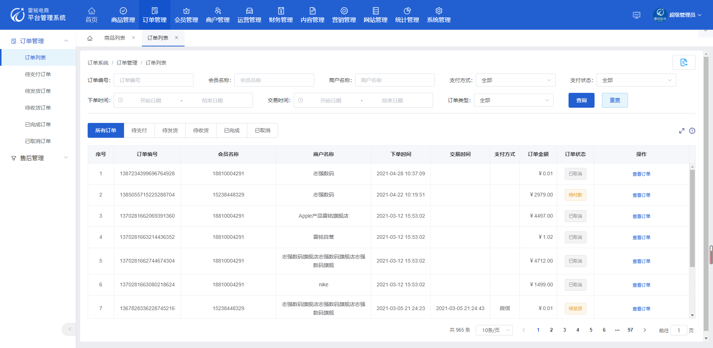

